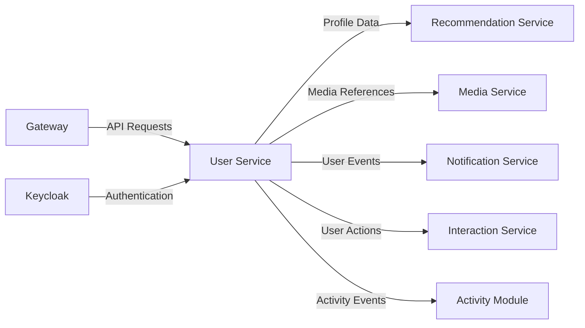

# User Service

[](https://openjdk.java.net/projects/jdk/21/)
[](https://spring.io/projects/spring-boot)
[](https://r2dbc.io/)
[](https://docs.spring.io/spring-framework/docs/current/reference/html/web-reactive.html)

## 📋 Overview

The **User Service** is the core domain service in the Infenia EasyMarry platform, responsible for comprehensive user management, profile creation, preferences, and authentication workflows. Built with reactive architecture using Spring Boot 3.x and WebFlux, it provides a robust, scalable foundation for matrimonial user interactions.

### 🎯 Key Responsibilities

- **👤 User Profile Management**: Complete user lifecycle from registration to profile management
- **🔐 Authentication & Authorization**: Integration with Keycloak for secure user authentication
- **📊 Preferences & Filters**: Comprehensive user preference and search criteria management
- **🏢 Professional Information**: Career, education, and profession-related data
- **🏠 Personal & Family Details**: Personal information, family background, horoscope data
- **📱 Social Media Integration**: Social media links and identity management
- **💰 Subscription Management**: User subscription plans and coin-based features
- **📈 Admin Controls**: Administrative oversight and user management capabilities

## 🏗️ Architecture

### Domain Model Structure

```
user/
├── 👤 User Domain
│   ├── UserEntity.java                    # Core user entity
│   ├── UserService.java                   # User business logic
│   ├── UserController.java                # REST API endpoints
│   └── UserRepository.java                # Data access layer
├── 📊 Profile Components
│   ├── PersonalInformation/               # Personal details
│   ├── Address/                          # Location information
│   ├── Education/                        # Educational background
│   ├── Profession/                       # Career information
│   ├── Family/                          # Family details
│   ├── Religion/                        # Religious information
│   ├── Horoscope/                       # Astrological data
│   ├── Physique/                        # Physical attributes
│   ├── Culture/                         # Cultural preferences
│   └── Habit/                           # Lifestyle habits
├── 🎯 Preferences
│   ├── PreferenceEntity.java             # Search preferences
│   └── PreferenceService.java            # Preference management
├── 🖼️ Media Management
│   ├── ImageEntity.java                  # Profile images
│   └── VideoEntity.java                  # Profile videos
├── 💰 Monetization
│   ├── SubscriptionEntity.java           # Subscription plans
│   └── CoinEntity.java                   # Virtual currency
├── 🔗 Integration
│   ├── SocialMediaEntity.java            # Social media links
│   └── IdpUserEntity.java                # Keycloak integration
└── 🛡️ Administration
    ├── AdminControlEntity.java           # Admin controls
    └── UserControlEntity.java            # User management
```

### Service Layer Patterns

The service follows sophisticated layered architecture patterns:

- **CRUD Service Hierarchy**: Extends base CRUD services for automatic functionality
- **Domain-Specific Services**: Specialized services for each domain area
- **Reactive Processing**: All operations return `Mono<T>` or `Flux<T>`
- **Cross-Cutting Concerns**: Integrated activity tracking and audit logging

## 🚀 Getting Started

### Prerequisites

- Java 21+
- PostgreSQL 12+
- Keycloak server (for authentication)
- Gradle 8.x

### Quick Start

```bash
# Build the service
./gradlew :user:build

# Run the service
./gradlew :user:bootRun

# Run tests
./gradlew :user:test

# Run specific domain tests
./gradlew :user:userTest
./gradlew :user:imageTest
./gradlew :user:preferenceTest
```

### Configuration

Basic configuration in `application.yaml`:

```yaml
server:
  port: 8081

spring:
  application:
    name: user-service

  r2dbc:
    url: r2dbc:postgresql://localhost:5432/user_db
    username: ${DB_USER:user_service}
    password: ${DB_PASSWORD:password}

# Keycloak Integration
idp:
  keycloak:
    enabled: true
    base-url: ${KEYCLOAK_URL:http://localhost:8080}
    realm: ${KEYCLOAK_REALM:easymarry}
    client-id: ${KEYCLOAK_CLIENT_ID:user-service}
    client-secret: ${KEYCLOAK_CLIENT_SECRET:secret}

# Caching Configuration
spring:
  cache:
    type: caffeine
    caffeine:
      spec: maximumSize=1000,expireAfterWrite=1h
```

## 🌐 API Endpoints

### User Management

| Method | Endpoint | Description | Response |
|--------|----------|-------------|----------|
| `POST` | `/api/users` | Create new user profile | `UserResponseDTO` |
| `GET` | `/api/users/{id}` | Get user by ID | `UserResponseDTO` |
| `PUT` | `/api/users/{id}` | Update user profile | `UserResponseDTO` |
| `DELETE` | `/api/users/{id}` | Soft delete user | `Mono<Void>` |
| `GET` | `/api/users` | Search users with filters | `Flux<UserResponseDTO>` |

### Profile Components

| Domain | Endpoints | Key Features |
|--------|-----------|--------------|
| **Personal** | `/api/users/{id}/personal` | Basic personal information |
| **Address** | `/api/users/{id}/address` | Location and address details |
| **Education** | `/api/users/{id}/education` | Educational background |
| **Profession** | `/api/users/{id}/profession` | Career information |
| **Family** | `/api/users/{id}/family` | Family background details |
| **Religion** | `/api/users/{id}/religion` | Religious information |
| **Horoscope** | `/api/users/{id}/horoscope` | Astrological details |
| **Physique** | `/api/users/{id}/physique` | Physical attributes |
| **Culture** | `/api/users/{id}/culture` | Cultural preferences |
| **Habits** | `/api/users/{id}/habits` | Lifestyle and habits |

### Preferences & Search

| Method | Endpoint | Description |
|--------|----------|-------------|
| `GET` | `/api/users/{id}/preferences` | Get user preferences |
| `PUT` | `/api/users/{id}/preferences` | Update search preferences |
| `GET` | `/api/users/search?criteria=...` | Advanced user search |

### Media Management

| Method | Endpoint | Description |
|--------|----------|-------------|
| `GET` | `/api/users/{id}/images` | Get profile images |
| `POST` | `/api/users/{id}/images` | Add profile image |
| `DELETE` | `/api/users/{id}/images/{imageId}` | Remove image |
| `GET` | `/api/users/{id}/videos` | Get profile videos |

### Administrative

| Method | Endpoint | Description | Access |
|--------|----------|-------------|--------|
| `GET` | `/api/admin/users` | Get all users | Admin only |
| `PUT` | `/api/admin/users/{id}/status` | Update user status | Admin only |
| `GET` | `/api/admin/users/analytics` | User analytics | Admin only |

## 🧪 Testing Strategy

### Test Organization

The User service uses a sophisticated testing framework with domain-specific organization:

```bash
# Domain-specific test execution
./gradlew :user:userTest           # Core user functionality
./gradlew :user:imageTest          # Image management
./gradlew :user:adminControlTest   # Administrative controls
./gradlew :user:preferenceTest     # User preferences
./gradlew :user:professionTest     # Professional information

# Layer-specific test execution
./gradlew :user:serviceTest        # Service layer tests
./gradlew :user:controllerTest     # Controller layer tests
./gradlew :user:integrationTest    # Full integration tests
```

### Test Framework Features

- **Test Utilities**: Uses `CrudServiceTester`, `ControllerTester`, `IntegrationTester`
- **Parameter Resolvers**: Automatic test data injection with `@ExtendWith(UserServiceParameterResolver.class)`
- **Reactive Testing**: Comprehensive `StepVerifier` usage for reactive streams
- **Cross-Service Testing**: Integration tests with embedded database and cross-service migrations

### Test Examples

```java
@ExtendWith(UserServiceParameterResolver.class)
@Tag("userTest")
@ServiceTest
class UserServiceTest extends CrudServiceTester<UserEntity, Long> {

    @Test
    void shouldCreateUserWithCompleteProfile(UserEntity testUser) {
        StepVerifier.create(userService.create(testUser))
            .assertNext(user -> {
                assertThat(user.getId()).isNotNull();
                assertThat(user.getEmail()).isEqualTo(testUser.getEmail());
            })
            .verifyComplete();
    }

    @AfterEach
    void verifyNoMoreInteractions() {
        Mockito.verifyNoMoreInteractions(mockDependencies);
    }
}
```

## 🗄️ Database Schema

### Core Tables

| Table | Description | Key Relationships |
|-------|-------------|------------------|
| `users` | Core user information | Primary entity |
| `personal_information` | Personal details | FK: user_id |
| `addresses` | Location information | FK: user_id |
| `education` | Educational background | FK: user_id |
| `professions` | Career information | FK: user_id |
| `family` | Family details | FK: user_id |
| `religion` | Religious information | FK: user_id |
| `horoscope` | Astrological data | FK: user_id |
| `physique` | Physical attributes | FK: user_id |
| `culture` | Cultural preferences | FK: user_id |
| `habits` | Lifestyle information | FK: user_id |
| `preferences` | Search preferences | FK: user_id |
| `images` | Profile images | FK: user_id |
| `videos` | Profile videos | FK: user_id |
| `subscriptions` | Subscription plans | FK: user_id |
| `coins` | Virtual currency | FK: user_id |
| `social_media` | Social media links | FK: user_id |
| `admin_control` | Administrative controls | FK: user_id |
| `user_control` | User management | FK: user_id |
| `idp_user` | Keycloak integration | FK: user_id |

### Migration Files

```bash
user/src/main/resources/db/migration/user/
├── V2023.09.24.01.59__create_user_table.sql
├── V2023.09.24.02.02__create_address_table.sql
├── V2023.09.24.02.03__create_education_table.sql
├── V2023.09.24.02.04__create_family_table.sql
├── V2023.09.24.02.05__create_horoscope_table.sql
├── V2023.09.24.02.06__create_identity_table.sql
├── V2023.09.24.02.07__create_image_table.sql
├── V2023.09.24.02.08__create_personal_information_table.sql
├── V2023.09.24.02.09__create_preference_table.sql
├── V2023.09.24.02.10__create_religion_table.sql
├── V2023.09.24.02.11__create_profession_table.sql
├── V2023.09.24.02.12__create_social_media_table.sql
├── V2023.09.24.02.13__create_subscription_table.sql
├── V2023.09.24.02.14__create_video_table.sql
├── V2023.10.31.00.45__create_idp_user_table.sql
├── V2024.11.05.23.34__create_physique_table.sql
├── V2024.11.05.23.35__create_culture_table.sql
├── V2024.11.06.16.05__create_admin_control_table.sql
├── V2024.11.06.16.06__create_user_control_table.sql
├── V2024.11.18.00.52__alter_family_table.sql
├── V2024.11.20.14.40__create_tracker_table.sql
├── V2024.11.20.19.37__create_coin_table.sql
├── V2024.11.22.23.13__create_habit_table.sql
├── V2025.01.06.10.57__add_column_user_Id_to_idp_user_table.sql
├── V2025.01.16.01.47__add_index_to_admin_control_table.sql
├── V2025.05.07.02.54__add_indexes_for_admin_query.sql
├── V2025.06.03.15.43__create_report_table.sql
└── V2025.06.03.15.48__create_report_state_table.sql
```

## 🔧 Development Patterns

### Entity Design

All entities follow consistent patterns:

```java
@Entity
@Table(name = "users")
public class UserEntity extends BaseEntity {

    @Id
    @GeneratedValue(strategy = GenerationType.IDENTITY)
    private Long id;

    @Column(nullable = false, unique = true)
    private String email;

    @Column(name = "first_name")
    private String firstName;

    // Soft delete support inherited from BaseEntity
    // Audit fields (createdAt, updatedAt) inherited
}
```

### Service Patterns

Services extend base CRUD services for automatic functionality:

```java
@Service
@RequiredArgsConstructor
public class UserService extends SoftDeleteCRUDService<UserEntity, Long> {

    private final UserRepository userRepository;
    private final ActivityEventPublisher eventPublisher;

    @Override
    protected BaseRepository<UserEntity, Long> getRepository() {
        return userRepository;
    }

    public Mono<UserEntity> findByEmail(String email) {
        return userRepository.findByEmailAndIsDeletedFalse(email)
            .doOnNext(user -> publishActivity("USER_LOOKUP", user.getId()));
    }

    private void publishActivity(String action, Long userId) {
        // Activity tracking integration
        eventPublisher.publishEvent(userId, createActivityDetails(action));
    }
}
```

### Repository Patterns

Repositories extend specialized base repositories:

```java
public interface UserRepository extends SoftDeleteRepository<UserEntity, Long> {

    Mono<UserEntity> findByEmailAndIsDeletedFalse(String email);

    @Query("SELECT u FROM UserEntity u WHERE u.isActive = true AND u.isDeleted = false")
    Flux<UserEntity> findActiveUsers();

    // Additional domain-specific queries
}
```

## 🎯 Key Features

### 1. Comprehensive Profile Management

- **Multi-Domain Profile**: 10+ domain areas covering all aspects of user information
- **Validation**: Comprehensive input validation with custom annotations
- **Privacy Controls**: Fine-grained privacy settings for profile components

### 2. Advanced Search & Preferences

- **Smart Matching**: Configurable preferences for partner search
- **Filter Criteria**: Age, location, profession, education, religion, caste filters
- **Saved Searches**: Users can save and manage search criteria

### 3. Media Management Integration

- **Profile Images**: Multiple image upload with primary image selection
- **Video Profiles**: Video introduction and profile videos
- **Media Validation**: Format, size, and content validation

### 4. Subscription & Monetization

- **Flexible Plans**: Multiple subscription tiers with different features
- **Coin System**: Virtual currency for premium features
- **Usage Tracking**: Monitor feature usage and subscription benefits

### 5. Administrative Controls

- **User Management**: Admin tools for user oversight
- **Content Moderation**: Profile review and approval workflows
- **Analytics**: User engagement and platform usage metrics

## 🔒 Security Features

### Authentication & Authorization

- **Keycloak Integration**: Full IDP integration for authentication
- **JWT Tokens**: Secure token-based authentication
- **Role-Based Access**: User, premium user, admin role management

### Data Protection

- **Input Validation**: Comprehensive validation using custom annotations
- **SQL Injection Prevention**: Parameterized queries with R2DBC
- **Privacy Controls**: User-controlled data visibility settings

## 📊 Monitoring & Observability

### Health Checks

```bash
# Service health
curl http://localhost:8081/actuator/health

# Database connectivity
curl http://localhost:8081/actuator/health/db

# Custom health indicators
curl http://localhost:8081/actuator/health/user-service
```

### Metrics

- **User Registration Rate**: New user registrations per day/hour
- **Profile Completion Rate**: Percentage of complete profiles
- **Activity Metrics**: User engagement and feature usage
- **Performance Metrics**: Response times and throughput

### Logging

- **Structured Logging**: JSON-formatted logs with trace correlation
- **Activity Tracking**: Automatic activity logging via activity module
- **Error Tracking**: Comprehensive error logging with context

## 🔧 Configuration Reference

### Database Configuration

```yaml
spring:
  r2dbc:
    url: r2dbc:postgresql://localhost:5432/user_db
    username: ${DB_USER}
    password: ${DB_PASSWORD}
    pool:
      initial-size: 10
      max-size: 20
      max-idle-time: 30m
      validation-query: SELECT 1
```

### Caching Configuration

```yaml
spring:
  cache:
    type: caffeine
    caffeine:
      spec: maximumSize=1000,expireAfterWrite=1h
    cache-names:
      - userCache
      - preferenceCache
      - profileCache
```

### Keycloak Configuration

```yaml
idp:
  keycloak:
    enabled: true
    base-url: ${KEYCLOAK_URL}
    realm: ${KEYCLOAK_REALM}
    client-id: ${KEYCLOAK_CLIENT_ID}
    client-secret: ${KEYCLOAK_CLIENT_SECRET}
```

## 🤝 Integration Points

### Dependent Services

- **Media Service**: Profile image and video management
- **Notification Service**: User communication and alerts
- **Interaction Service**: User interactions and connections
- **Recommendation Service**: Matching algorithm integration

### Data Flow



## 🚀 Performance Optimization

### Database Optimization

- **Indexes**: Strategic indexes for common query patterns
- **Connection Pooling**: R2DBC connection pool configuration
- **Query Optimization**: Efficient queries with projection and pagination

### Caching Strategy

- **Profile Caching**: Cache frequently accessed profile data
- **Preference Caching**: Cache search preferences for quick matching
- **Session Caching**: Cache user session data

### Reactive Optimization

- **Non-Blocking Operations**: All operations use reactive patterns
- **Backpressure Handling**: Proper backpressure management in streams
- **Resource Management**: Efficient resource cleanup and management

## 📋 TODO & Future Enhancements

### Short-term

- [ ] Enhanced profile completion tracking
- [ ] Advanced search filters
- [ ] Profile verification system
- [ ] Mobile app API optimization

### Long-term

- [ ] AI-powered profile recommendations
- [ ] Advanced matching algorithms
- [ ] Social media authentication
- [ ] Multi-language support
- [ ] Advanced analytics dashboard

## 📄 Documentation

### API Documentation

- **Swagger UI**: Available at `http://localhost:8081/swagger-ui.html`
- **OpenAPI Spec**: Auto-generated from code annotations
- **Postman Collection**: Available in `src/docs/` directory

### Architecture Documentation

- **Domain Models**: AsciiDoc files in `src/docs/asciidoc/`
- **Database Schema**: ERD diagrams and relationship documentation
- **Integration Guides**: Service integration patterns and examples

## 🛠️ Development Guidelines

### Code Standards

- **Google Java Style**: Enforced by Spotless
- **PMD Rules**: Custom ruleset in `pmd-user-ruleset.xml`
- **Reactive Patterns**: Mandatory use of reactive programming
- **Domain-Driven Design**: Clear domain boundaries and patterns

### Testing Requirements

- **100% Coverage Goal**: Aim for comprehensive test coverage
- **Domain-Specific Tests**: Organize tests by domain and layer
- **Integration Testing**: Use Testcontainers for database integration
- **Reactive Testing**: Use StepVerifier for all reactive operations

### Pull Request Checklist

- [ ] All tests pass (`./gradlew :user:test`)
- [ ] Code formatted (`./gradlew :user:spotlessApply`)
- [ ] PMD checks pass (`./gradlew :user:pmdMain`)
- [ ] Integration tests pass
- [ ] Documentation updated
- [ ] Migration scripts created (if needed)

## 📞 Support

For development questions:
- Check `CLAUDE.md` for AI development guidance
- Review test examples in test directories
- Consult architecture documentation
- Reach out to the User Service team

---

**Built with ❤️ for the Infenia EasyMarry Platform**
